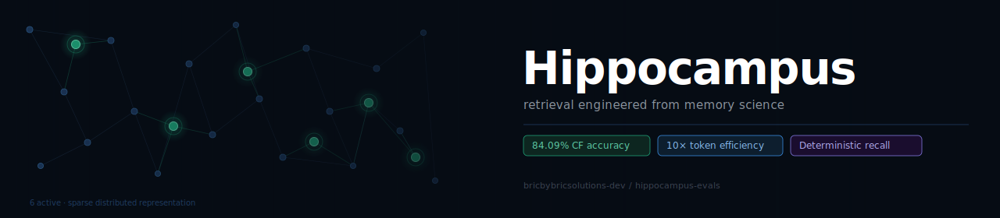

<div align="center">
  

  <br>

  [](LICENSE)
  [](results/summary.json)
  [](results/summary.json)
  [](data/wikipedia-44/)
  [](data/wikipedia-44/LICENSE)

  <br>

  **[Read the full write-up →](https://your-blog-post-link)** &nbsp;·&nbsp; **[Contact us](https://www.linkedin.com/in/anees-alsajir/)**

</div>

---

The hippocampus doesn't store memories as dense vectors. It uses sparse distributed codes — a small number of active neurons out of a much larger pool, where any meaningful overlap between two patterns is signal rather than noise. We built a retrieval engine around that motif: facts stored as 40-active-bit binary vectors out of 8,192, retrieved via lexical seeding into a typed relational graph, no embedding model at query time.

This repository contains the public benchmark artifacts for that claim. Not the production engine — the evidence.

## Results

| System | CF Accuracy | Non-list-tail CF | Tokens / answer |
|---|---|---|---|
| **Hippocampus** | **84.09%** | **86.84%** | **~12** |
| MiniLM-filtered | 75.00% | 86.84% | ~121 |
| BM25 | 31.82% | 36.84% | ~495 |

**CF = contradiction-free:** correct answer with no contradicting claims introduced. Stricter than top-1 accuracy — the right metric for production agents where a confident wrong answer is worse than no answer.

On non-list-tail facts (the majority of any real workload) Hippocampus matches MiniLM-filtered exactly at 86.84% CF — at 10× lower token cost. On list-tail facts, MiniLM-filtered scores 0% (filtering discards the relevant list context). Hippocampus scores 66.67%.

## Reproduce the table

```bash
npm install
npx tsx scripts/score.ts results/hippocampus.jsonl
```

Expected: `37/44 overall CF (84.09%) · 33/38 non-list-tail (86.84%) · ~12 mean tokens`

Every number is derivable from the JSONL files in `results/` using `scripts/score.ts`. The production engine is not in this repo.

## What's in this repo

```
hippocampus-evals/
├── data/
│   └── wikipedia-44/        44-fact benchmark, frozen 2024-12-31 (CC BY-SA 4.0)
├── results/
│   ├── hippocampus.jsonl    Per-fact results — commit hash, tokens, CF, failure category
│   ├── minilm-filtered.jsonl
│   ├── bm25.jsonl
│   └── summary.json         Headline numbers
├── scripts/
│   └── score.ts             Reproduces summary.json from any result JSONL
├── BENCHMARK.md             Dataset description and scoring definition
├── METHODOLOGY.md           Pre-committed falsifiers in plain English
├── FAILURES.md              The 8 facts we still get wrong, with root causes
├── LIMITATIONS.md           What we are not claiming
└── REPRODUCE.md             Full reproduction instructions
```

## The 8 facts we still get wrong

We publish these because knowing which bucket a failure belongs to is more useful than a cleaner number.

**4 fail on every system we tested** — Hippocampus, MiniLM-filtered, MiniLM-unfiltered, and BM25. Entity-slot queries where the question names a country or institution but the correct answer is indexed under a person's name. Zero lexical or semantic overlap on the entity. Not our failure specifically — these are at the boundary of what retrieval systems handle.

**4 are Hippocampus-specific** — two birth-place queries where the pipeline short-circuits before the role hint reaches seeding (fix is known and sequenced), one honorific query where the schema doesn't have the right atom indexed (corpus enrichment, not retrieval), and one succession query where the phrasing contains no succession verb.

Full analysis with per-fact root causes: [`FAILURES.md`](FAILURES.md)

## Methodology

Every acceptance bar in this project is written down before the experiment runs. We call them pre-committed falsifiers — you commit to what would falsify the claim, run it, and publish the result regardless. Across 70 checks in the full project: 45 pass, 25 fail. The failures are dated and root-caused.

The discipline changes how results read in both directions. When a bar passes, the commitment was made before the data. When something fails, it stays on the record — including mechanisms we'd named version numbers after before discovering they were decorative on aggregate metrics.

Full methodology: [`METHODOLOGY.md`](METHODOLOGY.md)

## Limitations

- Numbers are from a Wikipedia 44-fact benchmark. Generalization to other corpora is untested.
- The alias map was built for this corpus. Performance on different entity vocabularies is unknown.
- The token efficiency gap is architectural and expected to be robust. The accuracy number is what design partner pilots are for.

Full scope: [`LIMITATIONS.md`](LIMITATIONS.md)

## License

Code and scripts: [Apache 2.0](LICENSE)

Dataset (`data/wikipedia-44/`): [CC BY-SA 4.0](data/wikipedia-44/LICENSE) — derived from Wikipedia

---

<div align="center">
  <sub>Built by <a href="https://github.com/bricbybricsolutions-dev">BricbyBric</a> · Pre-committed falsifiers on every claim · <a href="https://www.linkedin.com/in/anees-alsajir/">Get in touch</a></sub>
</div>
